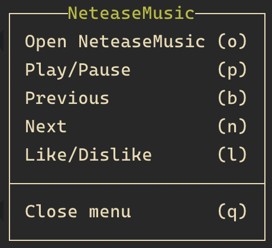

# NeteaseMusic plugin for tmux
[](https://opensource.org/licenses/MIT)

Show a nice menu to manage NeteaseMusic application.

<p align="center">
  
</p>

## Installation
### Requirements
* macOS
* tmux >= 3.0

### With Tmux Plugin Manager
Add the plugin in `.tmux.conf`:
```
set -g @plugin 'pldaily/tmux-NeteaseMusic'
```
Press `prefix + I` to fetch the plugin and source it. Done.

### Manual
Clone the repo somewhere. Add `run-shell` in the end of `.tmux.conf`:

```
run-shell PATH_TO_REPO/tmux-NeteaseMusic.tmux
```
NOTE: this line should be placed after `set-option -g status-right ...`.

Press `prefix + :` and type `source-file ~/.tmux.conf`. Done.

## Usage
Press tmux `prefix + m` (for example, `C-b m`) and you will see a nice menu:



```
* Open NeteaseMusic   (o) - open/launch NeteaseMusic
* Play/Pause          (p) - toggle play/pause
* Previous            (b) - play the current track from the beggining or play the previous track
* Next                (n) - play the next track
* Like/Dislike        (l) - toggle play/pause
* Close menu          (q) - close menu
```

## License
tmux-NeteaseMusic plugin is released under the [MIT License](https://opensource.org/licenses/MIT).
